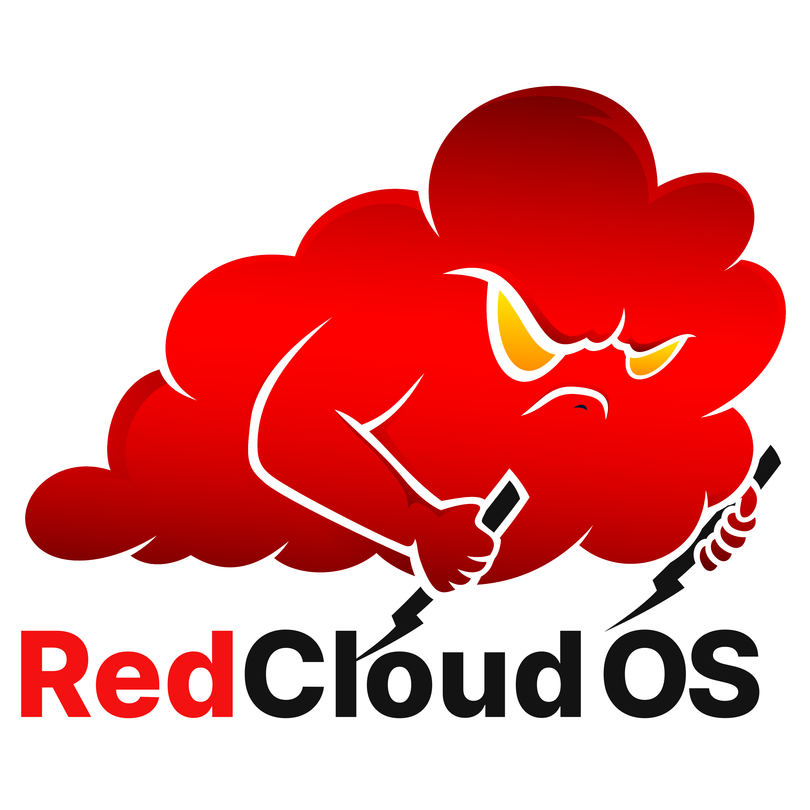

# RedCloud OS

<p align="center">
  
</p>

## Introduction

**RedCloud OS** is a [Debian](https://www.debian.org/)-based Cloud Adversary Simulation Operating System designed specifically for Red Teams to evaluate and enhance the security of leading Cloud Service Providers (CSPs). It comes equipped with a suite of tools optimized for adversary simulation tasks across [Amazon Web Services (AWS)](https://aws.amazon.com/), [Microsoft Azure](https://azure.microsoft.com/en-us), and [Google Cloud Platform (GCP)](https://cloud.google.com/).

### Credentials

- **Username:** `cwl`
- **Password:** `redcloud`

### System Specifications

- **Platform -** VMware Workstation _(Note: VMware Player may also work, but it has not been officially tested.)_

- **RAM -** 8GB or more recommended; 4GB minimum

- **CPU Cores -** 4 or more recommended; 2 minimum

- **Getting Started Guide -** [Getting Started with Cloud Red Team PDF](https://github.com/RedTeamOperations/RedCloud-OS/blob/main/build-scripts/Getting%20Started%20with%20Cloud%20Red%20Team.pdf)

## Available Tools

| **AWS**                                                         | **Azure**                                                       | **GCP**                                                      | **Multi-Cloud**  |
|-----------------------------------------------------------------|-----------------------------------------------------------------|--------------------------------------------------------------|----------------------------------------------------------------|
| [AWSCLI](https://github.com/aws/aws-cli/tree/v2)                | [AADCookieSpoof](https://github.com/jsa2/aadcookiespoof)        | [Gcloud CLI](https://cloud.google.com/sdk/gcloud/)           | [Cartography](https://github.com/lyft/cartography)             |
| [AWS Consoler](https://github.com/NetSPI/aws_consoler)          | [AADInternals](https://github.com/Gerenios/AADInternals)        | [GCPBucketBrute](https://github.com/RhinoSecurityLabs/GCPBucketBrute) | [CCAT](https://github.com/RhinoSecurityLabs/ccat)  |
| [AWS Escalate](https://github.com/RhinoSecurityLabs/Security-Research/blob/master/tools/aws-pentest-tools/aws_escalate.py) | [AZ CLI](https://github.com/Azure/azure-cli) | [GCP Delegation](https://gitlab.com/gitlab-com/gl-security/threatmanagement/redteam/redteam-public/gcp_misc) | [CloudBrute](https://github.com/0xsha/CloudBrute)  |
| [CloudCopy](https://github.com/Static-Flow/CloudCopy)           | [AzureAD](https://github.com/Azure/azure-docs-powershell-azuread) | [GCP Enum](https://gitlab.com/gitlab-com/gl-security/threatmanagement/redteam/redteam-public/gcp_enum) | [CloudEnum](https://github.com/initstring/cloud_enum/) |
| [CloudJack](https://github.com/prevade/cloudjack)               | [AzureHound](https://github.com/BloodHoundAD/AzureHound)        | [GCP Firewall Enum](https://gitlab.com/gitlab-com/gl-security/threatmanagement/redteam/redteam-public/gcp_firewall_enum) | [Cloud Service Enum](https://github.com/NotSoSecure/cloud-service-enum) |
| [CloudMapper](https://github.com/duo-labs/cloudmapper)          | [BloodHound](https://github.com/BloodHoundAD/BloodHound)        | [GCP IAM Collector](https://github.com/marcin-kolda/gcp-iam-collector) | [Evilginx2](https://github.com/kgretzky/evilginx2)  |
| [CredKing](https://github.com/ustayready/CredKing)              | [DCToolbox](https://github.com/DanielChronlund/DCToolbox)       | [GCP IAM Privilege Escalation](https://github.com/RhinoSecurityLabs/GCP-IAM-Privilege-Escalation) | [Gitleaks](https://github.com/gitleaks/gitleaks) |
| [Endgame](https://github.com/hoodoer/endgame)                   | [MFASweep](https://github.com/dafthack/MFASweep)                | [GCPTokenReuse](https://github.com/RedTeamOperations/GCPTokenReuse) | [Impacket](https://github.com/fortra/impacket) |
| [Pacu](https://github.com/RhinoSecurityLabs/pacu)               | [MicroBurst](https://github.com/NetSPI/MicroBurst)              | [GoogleWorkspaceDirectoryDump](https://github.com/RedTeamOperations/GoogleWorkspaceDirectoryDump) | [Leonidas](https://github.com/WithSecureLabs/leonidas) |
| [Redboto](https://github.com/ihamburglar/Redboto)               | [Microsoft365 devicePhish](https://github.com/optiv/Microsoft365_devicePhish) | [Hayat](https://github.com/DenizParlak/hayat)                | [Modlishka](https://github.com/drk1wi/Modlishka) |
| [weirdAAL](https://github.com/carnal0wnage/weirdAAL)            | [MS Graph](https://github.com/microsoftgraph/msgraph-sdk-powershell) |                                                              | [Mose](https://github.com/master-of-servers/mose)  |
|                                                                 | [PowerUpSQL](https://github.com/NetSPI/PowerUpSQL)             |                                                              | [PurplePanda](https://github.com/carlospolop/PurplePanda) |
|                                                                 | [ROADtools](https://github.com/dirkjanm/ROADtools)              |                                                              | [Responder](https://github.com/lgandx/Responder) |
|                                                                 | [TeamFiltration](https://github.com/Flangvik/TeamFiltration)    |                                                              | [ScoutSuite](https://github.com/nccgroup/ScoutSuite)  |
|                                                                 | [TokenTactics](https://github.com/rvrsh3ll/TokenTactics)        |                                                              | [SkyArk](https://github.com/cyberark/SkyArk)  |
|                                                                 |                                                                 |                                                              | [Zphisher](https://github.com/htr-tech/zphisher)  |

## Getting Started

### Download and Setup

- **Step 1** - Download the 7z archive from **_[this link](https://linktr.ee/redcloudos)_**.

- **Step 2** - Extract the contents of the archive to a convenient location on your computer.

- **Step 3** - Open **VMware Workstation**.
  - Go to **File** > **Open** (or press `Ctrl + O`).
  - Navigate to the folder where you extracted the files and select **RedCloud OS.ovf**.

- **Step 4** - Click **Import** to begin the import process.

## Usage

The OS setup is straightforward, with tools organized by Cloud Service Providers (CSPs). Each CSP has tools categorized into three sub-categories: **Enumeration**, **Exploitation**, and **Post Exploitation**. For efficient multitasking, **Terminator** is set as the default terminal.

### Launching Tools

You can launch each tool in one of four ways

- **By Menu Launcher** Click the tool's menu launcher.
- **Direct Execution** Run the `startup.sh` script located in the respective `/opt/` folder.
- **Startup Script** Execute the startup script from `/usr/local/bin`.
- **TAB Autocomplete** Use TAB autocomplete to search for the binary by tool name.

**Note:** PowerShell tools are named with initial capital letters, while other tools use lowercase. If you have any doubts, check `/usr/local/bin` for the correct tool names.

Some launchers, such as **Impacket** and **Redboto**, currently list only scripts and folder paths due to the extensive number of scripts involved. Future releases will include proper launchers for these tools and others with similar issues.

### Environmental Variables Setup

We have provided some examples of environmental variables required for certain tools to work. These variables however are not exhaustive and more can be needed on case-to-case basis.

##### AWS
```bash
export AWS_ACCESS_KEY_ID=<access_key_id>
export AWS_SECRET_ACCESS_KEY=<access_key>
export AWS_DEFAULT_REGION=<region>
```
##### Azure
```bash
export AZURE_CLIENT_ID = <app-id>
export AZURE_TENANT_ID = <tenant-id>
export AZURE_CLIENT_SECRET = <app-secret>

```
##### GCP
```bash
export GOOGLE_APPLICATION_CREDENTIALS = <Service Account Json File Path>
```

#### Aliases

During the development procedure, few aliases were used for the sake of convenience. These aliases are still in the user account and can be used.
```bash
alias c='clear'
alias a='nano ~/.bash_aliases'
alias s='source ~/.bash_aliases'
alias v='python3 -m venv venv && source venv/bin/activate'
alias d='deactivate'
alias p='pip3 install -r requirements.txt'
alias ll='ls -la'
```

## Building from scratch

1. Download base OS i.e, [Parrot OS Architect Edition 5.3](https://parrotsec.org/download/?version=architect) and proceed with installation in VMware/VirtualBox.
2. During VM installation, when prompted to choose components, select only Mate Desktop Environment and proceed.
3. Once installation is finished, launch the VM and clone this repo using `git clone https://github.com/RedTeamOperations/RedCloud-OS.git`
4. Navigate to `build-scripts` folder and make scripts executable.
5. First execute [uninstall.sh](https://github.com/RedTeamOperations/RedCloud-OS/blob/main/build-scripts/uninstall.sh) and wait for script to finish.
6. (_Optional_) Then execute [hold.sh](https://github.com/RedTeamOperations/RedCloud-OS/blob/main/build-scripts/hold.sh) and wait for script to finish.
7. Finally execute [install.sh](https://github.com/RedTeamOperations/RedCloud-OS/blob/main/build-scripts/install.sh) and wait for script to finish.
8. (_Optional_) Use `Menu Editor` to create applications launchers.
9. (_Optional_) Use `Dconf-Editor` to customize icons.
10. (_Optional_) Use `Grub Customizer` to modify Grub settings.

## Learning Materials

1. **AWS** [AWS Cloud Red Team Specialist [CARTS]](https://cyberwarfare.live/product/aws-cloud-red-team-specialist-carts/)
2. **GCP** [Google Cloud Red Team Specialist [CGRTS]](https://cyberwarfare.live/product/google-cloud-red-team-specialist-cgrts/)
3. **Multi-Cloud**
    - [Multi-Cloud Red Team Analyst [MCRTA]](https://cyberwarfare.live/product/multi-cloud-red-team-analyst-mcrta/)
    - [Hybrid Multi-Cloud Red Team Specialist [CHMRTS]](https://cyberwarfare.live/product/hybrid-multi-cloud-red-team-specialist-chmrts/)

## Future Roadmap
- [ ] [**Under Development**] Support for Apple Silicon Architecture

## Feedback

 RedCloud OS is an ongoing piece of development and your feedbacks/suggestions will help us enhance it furthermore. Feel free to either create an [**Issue**](https://github.com/RedTeamOperations/RedCloud-OS/issues) or email us at **info@cyberwarfare.live** with the subject "**RedCloud OS**".

## Acknowledgements

- [Parrot Security](https://www.parrotsec.org/) for providing the Base OS
- Creators/Developers/Contributors/Maintainers of all Open Source Components used within RedCloud OS
